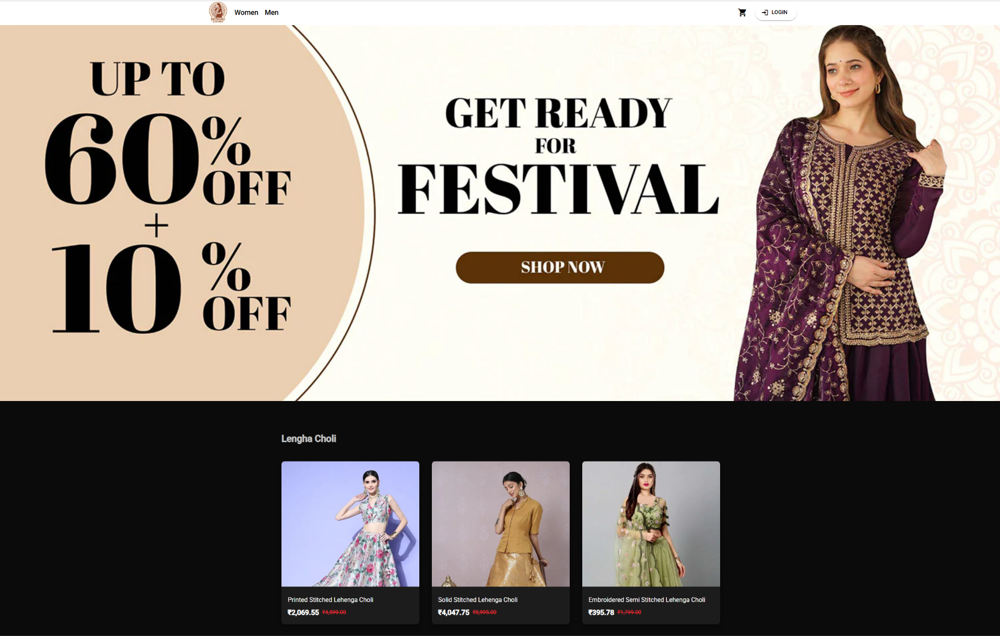
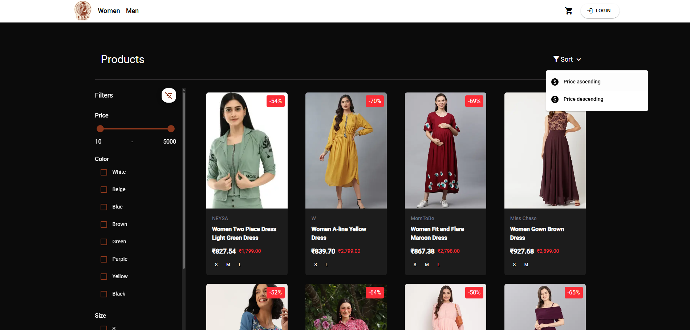
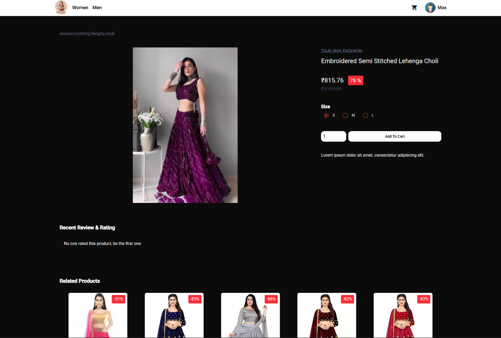
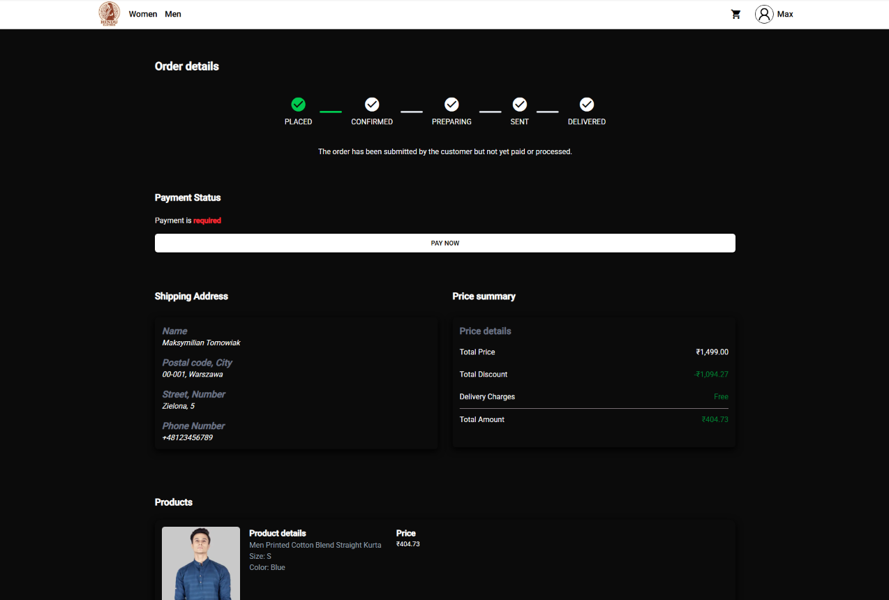
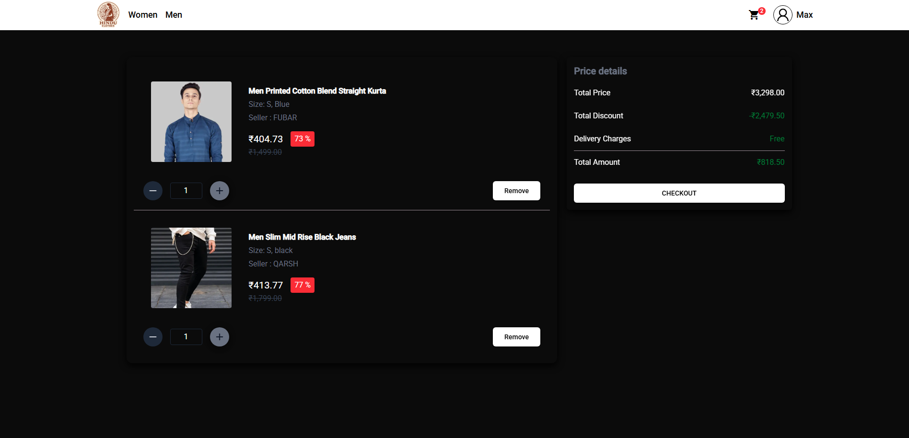
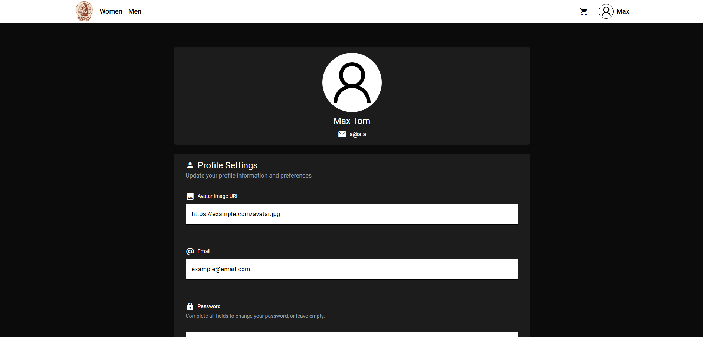
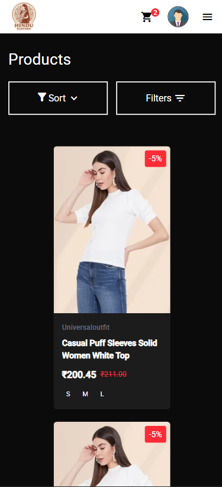
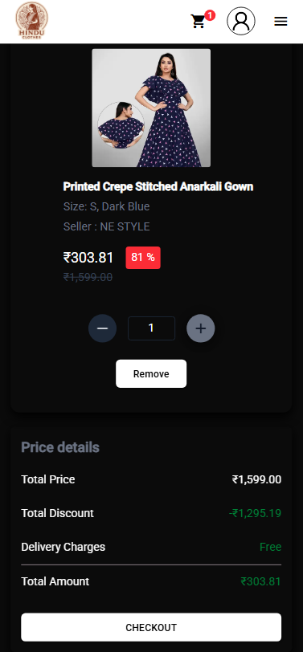
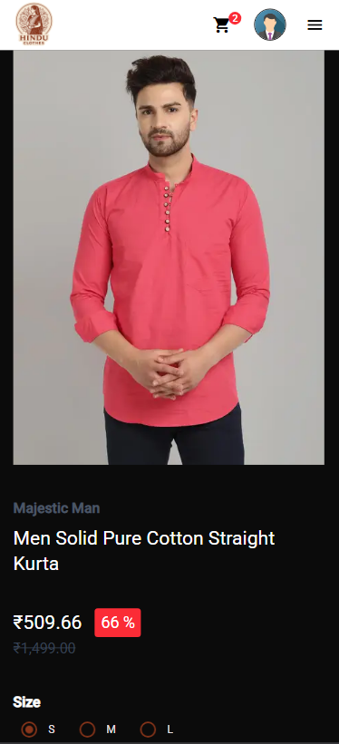
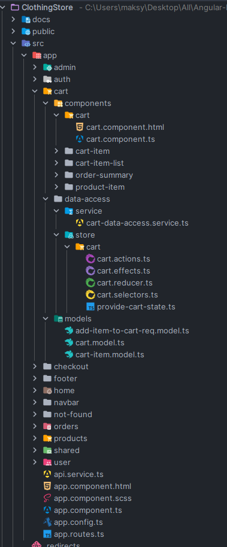

# Clothing Store - Hindu Clothes 

This is a sleek and modern e-commerce SPA web application focused on traditional Indian clothing. It allows users to browse clothing collections, view item details, filter products, and manage their shopping experience in a smooth, user-friendly interface.

 

## Deployed App 🌐

You can view the live app here 👉 [hindu-clothes.netlify.app](https://hindu-clothes.netlify.app/)

## Backend Repository 🗃️

Backend repository is accessible here 👉 [github.com/m4Ks-xyz/ClothingStoreApi](https://github.com/m4Ks-xyz/ClothingStoreApi/)

## Technologies Used 🛠️

| Technology | Purpose |
|------------|---------|
|  | For building a dynamic and component-based frontend |
|  | Ensures type safety and better code management |
|  | To handle asynchronous data streams |
|  | For managing complex application state |
|  | For utility-first responsive UI styling |
|  | For styling and responsive design |
|  | For deploying the site securely and efficiently |

## Main Features ✨

- **Product Catalog** – Browse a variety of traditional Indian clothing for men and women
- **Product Detail Pages** – View detailed descriptions, ratings, related products , sizes, images, and availability of selected product
- **Filtering & Sorting** – Filter products by type, gender, price, color, availability, size and sort by price or popularity
- **Orders Functionality** – Add, update, and browse your order history, pay your orders - (without payment gate)
- **Shopping Cart Functionality** – Add, update, and remove items from the cart
- **Profile Functionality** – Manage your profile data like email, password, avatar - (OFF for safety purposes - CORS)
- **Reusable & Modular Components** – Cleanly destructured components for product cards, category selectors, etc.
- **State Management with ngRx** – Stores communicate with backend, manage auth, product, cart, and user data  and track loading statuses independently
- **Responsive Design** – Fully optimized for desktop, tablet, and mobile devices
- **Environment** – .env files for environment variables

This project is architected for scalability, maintainability, and performance, following best practices in Angular, state management, and modular design. It serves as a practical example of building a modern, real-world e-commerce application with clean code structure, reusable components, and efficient data handling.

## Example .env file ♻️
```env
NG_APP_BACKEND_URL=backend.url
```

## Gallery 📷

### Product Catalog & Filters


### Product Details & Related Products


### Order Details


### Cart


### Profile Page


### Mobile Screenshots




### Example of Project Structure


